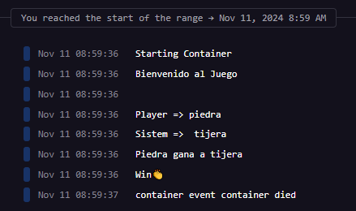
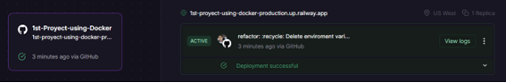

# Game with Python
## Results
<p align="center">
    
</p>


It is a program that presents the game rock paper scissors in Python

## :open_book: Repository on Github
* Clone the repository

    ```
    git clone https://github.com/ciizao/1st-Proyect-using-Docker.git
    ```

## :rocket: How to run in docker
### Pre-requisites
* Docker - DockerDesktop installed
* DockerHub account
### Download image
*Image in the Docker Hub repository and how to use it
```
https://hub.docker.com/repository/docker/ciizao/1st-proyect-using-docker-python/general
```
```
docker pull ciizao/1st-proyect-using-docker-python
```
### Run image
```
docker run --name <NEWCONTAINERNAME> <IMAGENAME>
```

> [!TIP]
> The name of the downloaded image must match the one placed in the previous command, for this you can verify it using the **docker images** command. Additionally, you must check that there is no other container with the same name as the one placed in the command.


[View results](#results)

## :light_rail: PAAS Deploy with docker (Railway)
For its deployment in a PAAS we will rely on railway and its easy implementation thanks to its container management. 




> [!IMPORTANT]
> Being a console program, the results are presented in the logs.


